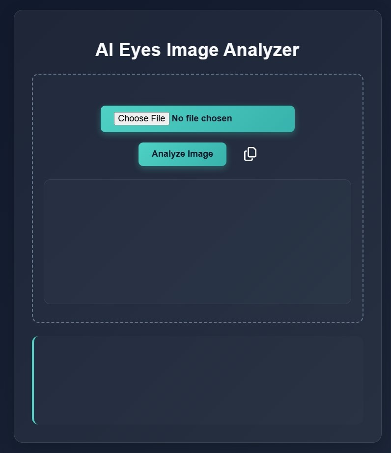
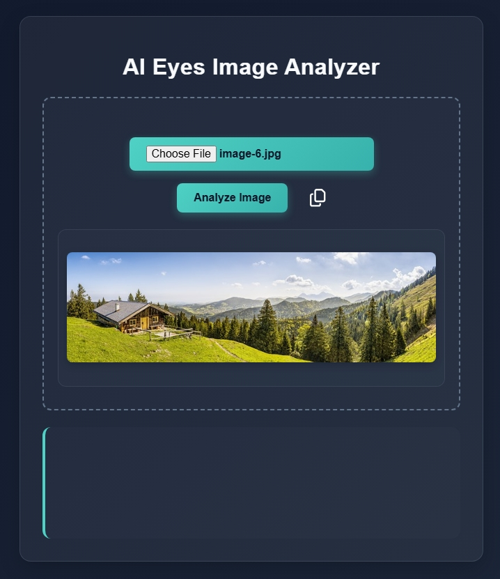
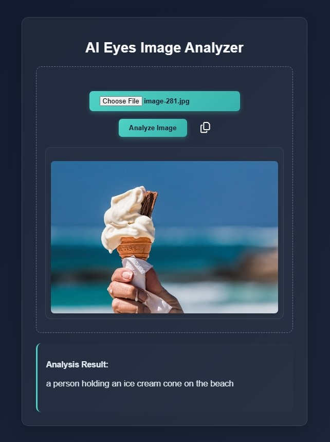
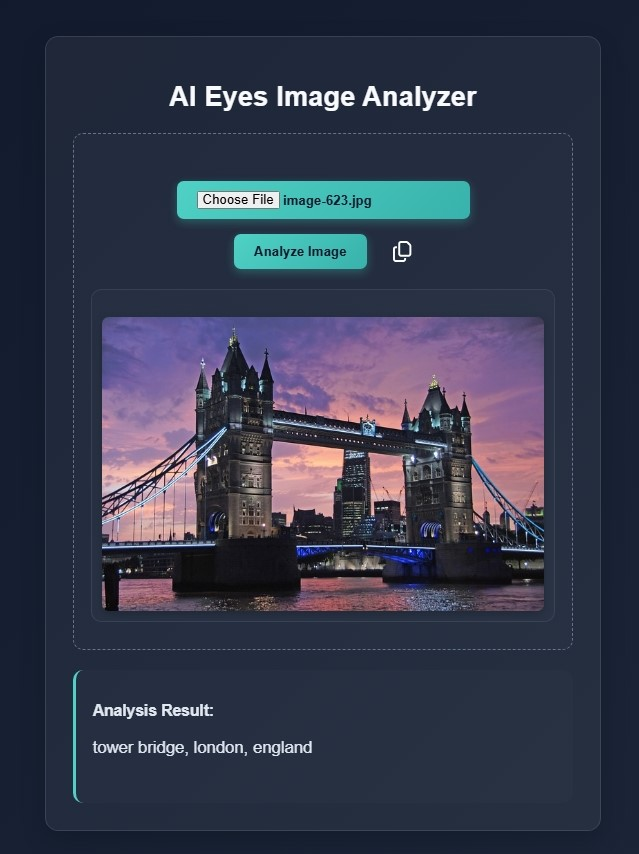
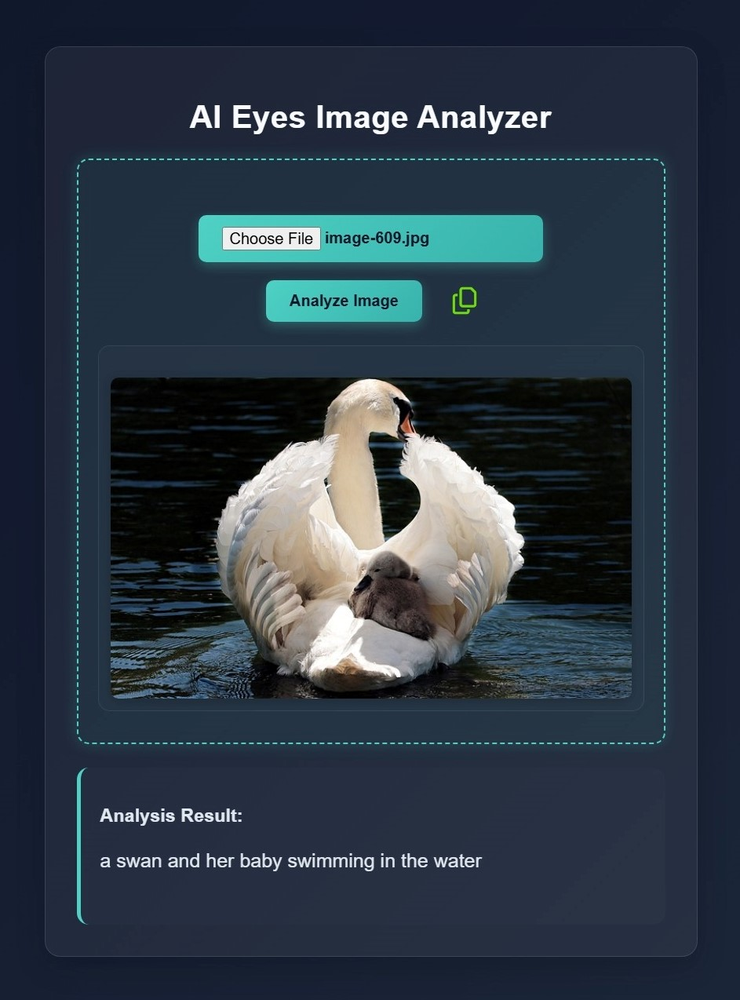

<a id="readme-top"></a>

# **AI Eyes Image Analyzer**  
🧠 *Convert Images to Text Descriptions Using AI*  

A simple web tool that analyzes images and generates descriptive text using AI that works fully offline. 

[](https://github.com/Code-inks/AI-Eyes/blob/main/README.md) 
[](https://github.com/Code-inks/AI-Eyes/blob/main/README.ar.md)
---
## ⚙️ **Built with**  

**Frontend**
- HTML (Hyper Text Markup Language)
- CSS (Cascading Style Sheet)
- Javascript

**Backend**
- Python (Python Libraries)
    - PIL (Python Imaging Library)
- Hugging Face Transformers
    - BILP (Generates captions or text from images)
    - PyTorch (Deep Learning Framework that runs BLIP model, Handels GPU acceleration if available)
- Flask (lightweight Python web framework, Handels Backend API)

---
## 📸 **Screenshots**
  <p>The interface is very simple with a button to upload and another to analyze the image once uploaded finally a copy to clipboard svg (which of course copys the generated text)
  <br>We have contianer for the image and another at the bottom for the generated text.</p>
  <p>The website has been tested and works on all screen sizes </p>
  
  
  <p> In the following images you can see how AI identifes human hand and the blury backgroung (image-281) while the next one recognises the tower bridge and it's location (image-623)</p>
  
  
    <p>This screenshot shows the copy to clipboard button when clicked (it turns to green for two seconds then goes back to its normal state)</p>
  

---

## 🔍 **How it works**  
Upload an image → Get AI-generated text description 

1. User uploads an image via the frontend.
2. JavaScript sends the image to Flask.
3. Flask saves the image temporarily and processes it with PIL.
4. BLIP generates text from the image using PyTorch.
5. Flask returns the text as JSON.
6. JavaScript displays the result on the webpage.
---

## 🧰 **Requirements**  
Before you begin, ensure you have:  
- Python 3.8+  
- pip (Python package manager)  

---

## 🚀 **Installation Guide**  

### 1. **Clone the Repository or Download the ZIP**  
I suggest that you Place the file in a short directory path `DriveName:\subs\PlaceFoldereHere`
```bash
git clone https://github.com/Code-inks/AI-Eyes/
```

### 2. **Install Dependencies**  
```bash
pip install flask pillow torch transformers
```

> ⚠️ **First-Time Note**: The BLIP model (~1.5GB) will download automatically on first run.

### 3. **Run the App**  
```bash
python app.py
```

### 4. **Access the App**  
Open your browser and visit:  
👉 [http://localhost:5000](http://localhost:5000)  
(You will automaticlly get the Link in your terminal)

---

## 📁 **Folder Structure**  
```
ai-eyes/
├── app.py               # Python Flask backend logic  
├── .venv                # Python dependencies(Auto Generated)
├── static/              # CSS and SVG files  
├── uploads/             # Auto Created
└── templates/           # HTML,JS templates  
```

---

## 🌐 **Features**  
- **AI-Powered Analysis**: Uses BLIP model for accurate image descriptions  
- **Modern UI**: Modern design with neon glow effects  
- **Copy-to-Clipboard**: SVG icon for copying results  
- **Screen Reader Support**: Generated text gets Read aloud 

---

## 📝 **License**  
This work is under MIT License which makes it free for sharing, modifying, and selling (in short do as you please with the code its an open source so enjoy!  :smile: ) 

---
## 🦾 **Improve** 
Feel free to improve my work and do share with me any updates :smile: !!

- [ ] Arabic Language Support
- [ ] Drag and Drop Images to Upload
- [ ] Upload Button Style (it still has a wanky ugly choose file 💀)
- [ ] Sort the Clipbord positioning (I wanted to palce it in the generate results box { javascript } but its better practice to keep it in my markdown am sure you guys will find a way around it!!)
- [ ] Generate detailed discription (instead of my basic short one)

---
## 📬 **Contact**

Contributions are what make the open source community such an amazing place to learn, inspire, and create. Any contributions you make are **greatly appreciated**.

- Maryam dev - [maryam]
- Find me on github [@MaryamBinabdullah]

Project Link: [MaryamBinabdullah/AI-Eyes/](https://github.com/MaryamBinabdullah/AI-Eyes/)

- I hope my codes aren't a big mess i tried to keep the whole thing tidy and to point as much as possible
- you'll find some comments here and there explaning how things work

Don't forget to give the project a star! Thanks again! :smile:

---

**👀 AI Eyes** is perfect for developers, educators, and content creators who want to bridge the gap between visual data and textual understanding. Try it and let your images speak! 🚀  

<p align="right">(<a href="#readme-top">back to top</a>)</p>
